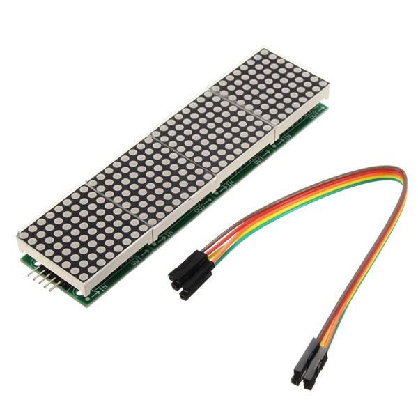
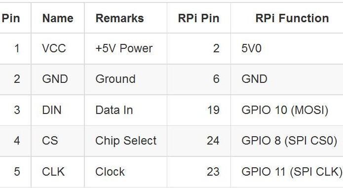
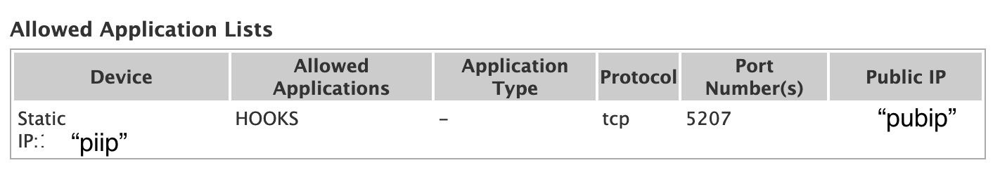
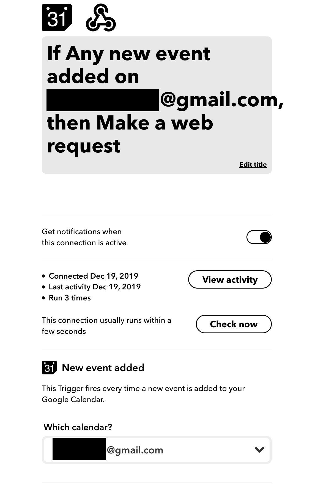
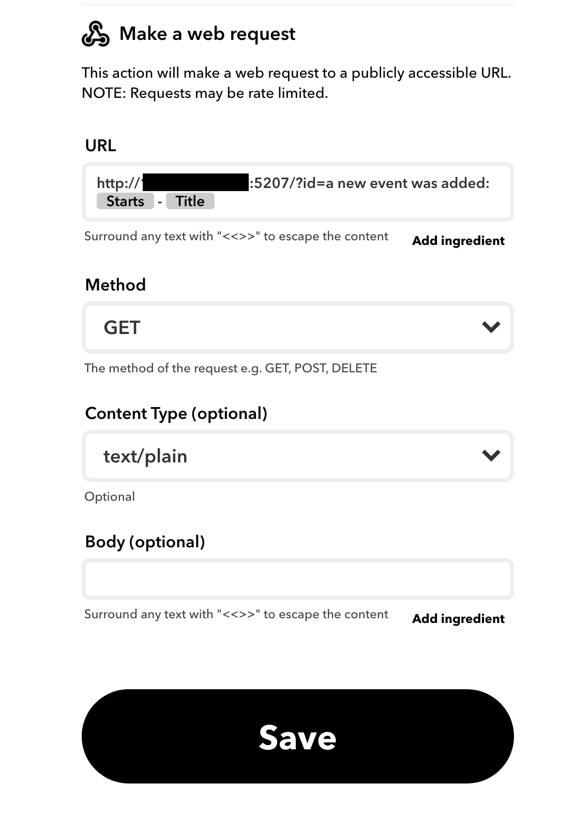

**Hooks2**

Creates a smart clock with a webserver used as webhook to receive messages from IFTTT.
Built with a Raspberry Pi 3 Model B Rev 1.2 Raspbian GNU/Linux version "10 (buster)" and 
a 4 module MAX7219 (8x32 matrix) and python 2.7.

NOTE: If not cloned into `/home/pi` then paths need to be updated in the following locations and the in the instructions that follow.:
- `clock.py` line 58
- `hooks2.py` line 36 && 44
- `ledclock.service` line 7
- `leddisplay.service` line 7

Additional reference : https://max7219.readthedocs.io/en/0.2.3/

**Hardware**
1. Need a Raspberry Pi 
   (4) module MAX7219 
   

   (5) female - female wire jumpers 
2. On Raspberry Pi enable the GPIO interface
   sudo raspi-config
    Select option "5 Interfacing Options" and then 
                  "P5 I2C Enable/Disable automtic loading of SPI kernel module"
3. connect MAX7219 to Raspberry Pi GPIO pins using the (5) jumper wires
   MAX7219 VCC to RPI pin 2 
   MAX7219 GND to RPI pin 6
   MAX7219 DIN to RPI pin 19 
   MAX7219 CS to RPI pin 24 
   MAX7219 CLK to RPI pin 23 

   

**On Raspberry pi**
1. install web.py to service the web requests
     ```
     sudo pip install web.py==0.39
     ```

2. install luma.led_matrix to provide the max7219 display libraries
    ```
    sudo pip install luma.led_matrix==1.4.1
    ```

3. run clock.py to create the clock display
    ```
    /usr/bin/python /home/pi/hooks2/clock.py
    ```

4. run hooks2.py to create the webserver
    ```
     /usr/bin/python /home/pi/hooks2/hooks2.py
    ```

5. if you want clock & hooks2 to run at startup, create 2 services & allow permissions
    ```
    sudo cp ledclock.service /usr/lib/systemd/system
    sudo cp leddisplay.service /usr/lib/systemd/system
    ```
   
   Reload systemctl daemon, enable the 2 services and start them   
   ```
    sudo systemctl daemon-reload
    sudo systemctl enable leddisplay.service
    sudo systemctl enable ledclock.service
    ```
   
   Start the services
   ```
    sudo systemctl start leddisplay.service
    sudo systemctl start ledclock.service
    ```

7. monitor the services using their log files; clock.log & hooks2.log or 
   by checking the service status
   ```
    sudo systemctl status leddisplay.service
    sudo systemctl status ledclock.service
    ```

8. testing
   If you started the ledclock service or just run the clock script, a clock should display
   To test your webserver inside the firewall: 
   get the static ip address for your raspberry pi (piip).
   open a browser to http://piip:8080/?id=hello world
   after the display updates, the web page should return with "hello world"  
   
On your router
1. Create a rule on your router/firewall to redirect connections on your 
   public ip address & special port to your raspberry pi running the web server on port 8080.
   Get the static public ip address from your routers internet connection (pubip).
   Get the static ip address for your raspberry pi (piip).
   Create a firewall rule like;
    any inbound traffic on "pubip" port 5207 redirect to "piip" port 8080

    

On IFTTT
1. Create applets that will send messages to your smart clock. The smart clock end point on 
   ifttt is a webhook. 
   - URL: built from your public ip, port and the applet ingredients.
   - Method: GET
   - Content Type: text/plain
   - Body: leave blank 
   for example ifttt will send a message when any new event is added to my google calendar
   Create applet, if Google Calender - any new event then Webhook 
   - URL: http://pubip:5207/?id=a new event was added: {{Starts}} - {{Title}}
   - Method: GET
   - Content Type: text/plain
   - Body: leave blank 

    
    


2. Create other applets with the "then" part as a webhook. 
   Use the same url and add what ever ingredients you like.
   
